# Core Lending Loan Origination Microservice

## Overview

The Core Lending Loan Origination Microservice is a critical component of the Firefly platform, responsible for managing the loan origination process. This service handles loan applications, underwriting decisions, scoring, and other aspects of the loan origination workflow.

Built with Java 21 and Spring Boot, this microservice follows a reactive programming model using Project Reactor (Mono/Flux) for efficient handling of asynchronous operations and high throughput.

## Architecture

The microservice is structured as a multi-module Maven project with the following components:

### Modules

1. **core-lending-loan-origination-interfaces**
   - Contains DTOs (Data Transfer Objects), interfaces, and enums
   - Defines the contract between the microservice and its clients
   - Includes validation annotations and Swagger/OpenAPI documentation

2. **core-lending-loan-origination-models**
   - Contains entity definitions and repository interfaces
   - Manages database interactions and data persistence
   - Implements JPA repositories for data access

3. **core-lending-loan-origination-core**
   - Contains business logic and service implementations
   - Implements the core functionality of the microservice
   - Handles transaction management and business rules

4. **core-lending-loan-origination-web**
   - Contains REST controllers and API endpoints
   - Manages HTTP requests and responses
   - Implements API versioning and documentation

## Key Features

- **Loan Application Management**: Create, retrieve, update, and delete loan applications
- **Underwriting Decision Management**: Record and manage underwriting decisions for loan applications
- **Scoring System**: Evaluate and score loan applications based on various criteria
- **Reactive Programming Model**: Non-blocking I/O for high throughput and scalability
- **RESTful API**: Well-documented API with OpenAPI/Swagger annotations
- **Pagination and Filtering**: Support for paginated results and advanced filtering

## Data Model

### Entity Relationship Diagram

The following diagram illustrates the relationships between entities in the system and includes detailed attributes for each entity. Primary keys (PK) and foreign keys (FK) are indicated to clearly show the relationships between entities.

```mermaid
erDiagram
    LoanApplication {
        Long loanApplicationId PK
        UUID applicationNumber
        Long applicationStatusId FK
        Long applicationSubStatusId FK
        LocalDate applicationDate
        Long submissionChannelId FK
        Long partyId
        Long distributorId
        String note
        LocalDateTime createdAt
        LocalDateTime updatedAt
    }
    
    ApplicationParty {
        Long applicationPartyId PK
        Long loanApplicationId FK
        Long partyId
        Long roleCodeId FK
        BigDecimal sharePercentage
        BigDecimal annualIncome
        BigDecimal monthlyExpenses
        Long employmentTypeId FK
        LocalDateTime createdAt
        LocalDateTime updatedAt
    }
    
    ApplicationDocument {
        Long applicationDocumentId PK
        Long loanApplicationId FK
        Long documentId
        Long documentTypeId FK
        Boolean isMandatory
        Boolean isReceived
        LocalDateTime receivedAt
        LocalDateTime createdAt
        LocalDateTime updatedAt
    }
    
    ApplicationCollateral {
        Long applicationCollateralId PK
        Long loanApplicationId FK
        Long collateralTypeId FK
        BigDecimal estimatedValue
        String ownershipDetails
        Boolean isPrimaryCollateral
        LocalDateTime createdAt
        LocalDateTime updatedAt
    }
    
    ProposedOffer {
        Long proposedOfferId PK
        Long loanApplicationId FK
        Long productId
        BigDecimal requestedAmount
        Integer requestedTenorMonths
        BigDecimal requestedInterestRate
        LocalDate validUntil
        LocalDateTime createdAt
        LocalDateTime updatedAt
    }
    
    UnderwritingScore {
        Long underwritingScoreId PK
        Long loanApplicationId FK
        BigDecimal scoreValue
        String scorecardName
        String reasonCodes
        LocalDateTime scoringTimestamp
        LocalDateTime createdAt
        LocalDateTime updatedAt
    }
    
    UnderwritingDecision {
        Long underwritingDecisionId PK
        Long loanApplicationId FK
        LocalDateTime decisionDate
        Long decisionCodeId FK
        BigDecimal approvedAmount
        BigDecimal approvedInterestRate
        Integer tenorMonths
        Long riskGradeId FK
        String remarks
        LocalDateTime createdAt
        LocalDateTime updatedAt
    }
    
    LoanApplicationStatusHistory {
        Long statusHistoryId PK
        Long loanApplicationId FK
        Long oldStatusId FK
        Long newStatusId FK
        String changeReason
        LocalDateTime changedAt
        String changedBy
        LocalDateTime createdAt
        LocalDateTime updatedAt
    }
    
    ApplicationStatus {
        Long applicationStatusId PK
        String code
        String name
        String description
        Boolean isActive
        LocalDateTime createdAt
        LocalDateTime updatedAt
    }
    
    ApplicationSubStatus {
        Long applicationSubStatusId PK
        String code
        String name
        String description
        Boolean isActive
        LocalDateTime createdAt
        LocalDateTime updatedAt
    }
    
    SubmissionChannel {
        Long submissionChannelId PK
        String code
        String name
        String description
        Boolean isActive
        LocalDateTime createdAt
        LocalDateTime updatedAt
    }
    
    RoleCode {
        Long roleCodeId PK
        String code
        String name
        String description
        Boolean isActive
        LocalDateTime createdAt
        LocalDateTime updatedAt
    }
    
    EmploymentType {
        Long employmentTypeId PK
        String code
        String name
        String description
        Boolean isActive
        LocalDateTime createdAt
        LocalDateTime updatedAt
    }
    
    DocumentType {
        Long documentTypeId PK
        String code
        String name
        String description
        Boolean isActive
        LocalDateTime createdAt
        LocalDateTime updatedAt
    }
    
    CollateralType {
        Long collateralTypeId PK
        String code
        String name
        String description
        Boolean isActive
        LocalDateTime createdAt
        LocalDateTime updatedAt
    }
    
    DecisionCode {
        Long decisionCodeId PK
        String code
        String name
        String description
        Boolean isActive
        LocalDateTime createdAt
        LocalDateTime updatedAt
    }
    
    RiskGrade {
        Long riskGradeId PK
        String code
        String name
        String description
        Boolean isActive
        LocalDateTime createdAt
        LocalDateTime updatedAt
    }
    
    LoanApplication ||--o{ ApplicationParty : has
    LoanApplication ||--o{ ApplicationDocument : has
    LoanApplication ||--o{ ApplicationCollateral : has
    LoanApplication ||--o{ ProposedOffer : has
    LoanApplication ||--o{ UnderwritingScore : has
    LoanApplication ||--o{ UnderwritingDecision : has
    LoanApplication ||--o{ LoanApplicationStatusHistory : has
    LoanApplication }|--|| ApplicationStatus : has
    LoanApplication }|--|| ApplicationSubStatus : has
    LoanApplication }|--|| SubmissionChannel : has
    
    ApplicationParty }|--|| RoleCode : has
    ApplicationParty }|--|| EmploymentType : has
    
    ApplicationDocument }|--|| DocumentType : has
    
    ApplicationCollateral }|--|| CollateralType : has
    
    UnderwritingDecision }|--|| DecisionCode : has
    UnderwritingDecision }|--|| RiskGrade : has
    
    UnderwritingScore }|--|| RiskGrade : has
    
    LoanApplicationStatusHistory }|--|| ApplicationStatus : "oldStatus"
    LoanApplicationStatusHistory }|--|| ApplicationStatus : "newStatus"
```



### Catalog Entities

The system uses catalog entities instead of enums to allow for dynamic management of these values:

1. **ApplicationStatus**: Represents the status of a loan application (DRAFT, SUBMITTED, UNDER_REVIEW, APPROVED, REJECTED)
2. **ApplicationSubStatus**: Represents additional status details (PENDING_DOCUMENTS, NEEDS_MANUAL_REVIEW, COMPLETE)
3. **SubmissionChannel**: Represents the channel through which the application was submitted (BRANCH, ONLINE, MOBILE)
4. **RoleCode**: Represents the role of a party in the application (PRIMARY_APPLICANT, CO_APPLICANT, GUARANTOR)
5. **EmploymentType**: Represents the employment type of a party (SALARIED, SELF_EMPLOYED, UNEMPLOYED, RETIRED, OTHER)
6. **DocumentType**: Represents the type of a document (ID_PROOF, PAYSLIP, PROPERTY_DEED, BANK_STATEMENT, OTHER)
7. **CollateralType**: Represents the type of collateral (REAL_ESTATE, VEHICLE, FINANCIAL_ASSET, OTHER)
8. **DecisionCode**: Represents the decision on a loan application (APPROVED, DECLINED, WITHDRAWN, COUNTER_OFFER)
9. **RiskGrade**: Represents the risk grade assigned to an application (A, B, C, D, HIGH_RISK)

### Loan Application

The core entity of the system that represents a customer's application for a loan.

**Key Fields:**
- `loanApplicationId`: Unique identifier for the loan application
- `applicationNumber`: Auto-generated UUID that uniquely identifies the application
- `applicationStatusId`: Foreign key to the ApplicationStatus catalog entity
- `applicationSubStatusId`: Foreign key to the ApplicationSubStatus catalog entity
- `applicationDate`: Date when the application was submitted
- `submissionChannelId`: Foreign key to the SubmissionChannel catalog entity
- `partyId`: Identifier for a known customer who launched the application (can be null for unknown customers)
- `distributorId`: Identifier for a known distributor who launched the application (can be null if not submitted via distributor)
- `note`: Additional notes or comments about the application

**Relationships:**
- One-to-many with Application Parties
- One-to-many with Application Documents
- One-to-many with Application Collaterals
- One-to-many with Proposed Offers
- One-to-many with Underwriting Scores
- One-to-many with Underwriting Decisions
- One-to-many with Loan Application Status History
- Many-to-one with Application Status
- Many-to-one with Application Sub Status
- Many-to-one with Submission Channel

## Prerequisites

- Java Development Kit (JDK) 21
- Maven 3.8+
- Docker (for containerized deployment)
- PostgreSQL (or compatible database)

## Setup and Installation

### Local Development

1. Clone the repository:
   ```bash
   git clone https://github.com/your-organization/core-lending-loan-origination.git
   cd core-lending-loan-origination
   ```

2. Build the project:
   ```bash
   mvn clean install
   ```

3. Run the application:
   ```bash
   mvn spring-boot:run -pl core-lending-loan-origination-web
   ```

### Docker Deployment

1. Build the Docker image:
   ```bash
   mvn clean package
   docker build -t core-lending-loan-origination:latest .
   ```

2. Run the Docker container:
   ```bash
   docker run -p 8080:8080 core-lending-loan-origination:latest
   ```

## Configuration

The application can be configured through the `application.properties` or `application.yml` file in the `core-lending-loan-origination-web/src/main/resources` directory. Key configuration properties include:

- Database connection settings
- Logging levels
- Security settings
- External service endpoints

## API Quick Start Guide

The Core Lending Loan Origination API provides a RESTful interface for managing loan applications and related resources. This guide will help you get started quickly with the API.

### API Documentation

For detailed API documentation, you can access the Swagger UI when the application is running:

```
http://localhost:8080/swagger-ui.html
```


### Common Patterns

- **Base URL**: All API endpoints start with `/api/v1`
- **Content Type**: All requests and responses use JSON (`application/json`)
- **Pagination**: Collection endpoints support pagination with `page`, `size`, and `sort` parameters
- **Resource Hierarchy**: Most resources are nested under loan applications

### Quick Examples

#### 1. Create a Loan Application

```bash
# Request
curl -X POST "http://localhost:8080/api/v1/loan-applications" \
  -H "Content-Type: application/json" \
  -d '{
    "applicationStatus": "DRAFT",
    "applicationSubStatus": "PENDING_DOCUMENTS",
    "applicationDate": "2025-07-29",
    "submissionChannel": "ONLINE",
    "partyId": 456,
    "note": "Sample loan application"
  }'

# Response
{
  "loanApplicationId": 123,
  "applicationNumber": "550e8400-e29b-41d4-a716-446655440000",
  "applicationStatus": "DRAFT",
  "applicationSubStatus": "PENDING_DOCUMENTS",
  "applicationDate": "2025-07-29",
  "submissionChannel": "ONLINE",
  "partyId": 456,
  "distributorId": null,
  "note": "Sample loan application",
  "createdAt": "2025-07-29T10:27:00.000+00:00",
  "updatedAt": "2025-07-29T10:27:00.000+00:00"
}
```

#### 2. Add a Party to a Loan Application

```bash
# Request
curl -X POST "http://localhost:8080/api/v1/loan-applications/123/parties" \
  -H "Content-Type: application/json" \
  -d '{
    "partyId": 456,
    "roleCodeId": 1,
    "sharePercentage": 100.0,
    "annualIncome": 75000.0,
    "monthlyExpenses": 2500.0,
    "employmentTypeId": 1
  }'
```

#### 3. Add Collateral to a Loan Application

```bash
# Request
curl -X POST "http://localhost:8080/api/v1/loan-applications/123/collaterals" \
  -H "Content-Type: application/json" \
  -d '{
    "collateralTypeId": 1,
    "estimatedValue": 250000.0,
    "ownershipDetails": "Sole owner",
    "isPrimaryCollateral": true
  }'
```

#### 4. Record an Underwriting Decision

```bash
# Request
curl -X POST "http://localhost:8080/api/v1/loan-applications/123/decisions" \
  -H "Content-Type: application/json" \
  -d '{
    "decisionCodeId": 1,
    "approvedAmount": 95000.0,
    "approvedInterestRate": 5.75,
    "tenorMonths": 36,
    "riskGradeId": 2,
    "remarks": "Approved with slightly higher interest rate"
  }'
```

### Key Resources

| Resource | Description | Main Endpoints |
|----------|-------------|---------------|
| **Loan Applications** | Core resource representing a customer's application for a loan | `GET/POST /loan-applications`, `GET/PUT/DELETE /loan-applications/{id}` |
| **Application Parties** | Individuals or entities associated with a loan application | `GET/POST /loan-applications/{id}/parties`, `GET/PUT/DELETE /loan-applications/{id}/parties/{partyId}` |
| **Application Documents** | Documents associated with a loan application | `GET/POST /loan-applications/{id}/documents`, `GET/PUT/DELETE /loan-applications/{id}/documents/{documentId}` |
| **Application Collaterals** | Assets pledged as security for a loan | `GET/POST /loan-applications/{id}/collaterals`, `GET/PUT/DELETE /loan-applications/{id}/collaterals/{collateralId}` |
| **Proposed Offers** | Loan offers made to applicants | `GET/POST /loan-applications/{id}/offers`, `GET/PUT/DELETE /loan-applications/{id}/offers/{offerId}` |
| **Underwriting Decisions** | Decisions made on loan applications | `GET/POST /loan-applications/{id}/decisions`, `GET/PUT/DELETE /loan-applications/{id}/decisions/{decisionId}` |
| **Underwriting Scores** | Risk assessments of loan applications | `GET/POST /loan-applications/{id}/scores`, `GET/PUT/DELETE /loan-applications/{id}/scores/{scoreId}` |
| **Status History** | Changes to the status of a loan application | `GET/POST /loan-applications/{id}/status-history`, `GET/PUT/DELETE /loan-applications/{id}/status-history/{historyId}` |

### Error Handling

The API uses standard HTTP status codes and returns error details in the response body:

```json
{
  "timestamp": "2025-07-29T10:27:00.000+00:00",
  "status": 400,
  "error": "Bad Request",
  "message": "Invalid request parameters",
  "path": "/api/v1/loan-applications"
}
```


## Development Guidelines

### Code Style

This project follows the Google Java Style Guide. You can ensure your code adheres to the style guide by using the provided checkstyle configuration:

```bash
mvn checkstyle:check
```

### Testing

The project uses JUnit 5 for unit testing and Spring Boot Test for integration testing. To run the tests:

```bash
mvn test
```

For test coverage reports:

```bash
mvn jacoco:report
```

### Branching Strategy

- `main` - Production-ready code
- `develop` - Integration branch for feature development
- `feature/*` - Feature branches
- `bugfix/*` - Bug fix branches
- `release/*` - Release preparation branches

### Commit Message Format

Follow the conventional commits specification:

```
<type>(<scope>): <description>

[optional body]

[optional footer(s)]
```

Types: feat, fix, docs, style, refactor, test, chore

## Deployment

### CI/CD Pipeline

The project uses a CI/CD pipeline for automated testing, building, and deployment. The pipeline is triggered on push to the repository and includes:

1. Code quality checks
2. Unit and integration tests
3. Building the application
4. Building the Docker image
5. Deploying to the target environment

### Environments

- **Development**: Automatically deployed from the `develop` branch
- **Staging**: Deployed from `release/*` branches after QA approval
- **Production**: Deployed from the `main` branch after staging validation

## Monitoring and Logging

The application includes:

- Prometheus metrics for monitoring
- Structured logging with JSON format
- Distributed tracing with Spring Cloud Sleuth and Zipkin
- Health check endpoints for Kubernetes liveness and readiness probes

## Contributing

1. Fork the repository
2. Create a feature branch (`git checkout -b feature/amazing-feature`)
3. Commit your changes (`git commit -m 'feat: add amazing feature'`)
4. Push to the branch (`git push origin feature/amazing-feature`)
5. Open a Pull Request