# Core Lending Loan Origination Microservice

[](https://opensource.org/licenses/Apache-2.0)
[](https://openjdk.java.net/projects/jdk/25/)
[](https://spring.io/projects/spring-boot)

## Overview

The **Core Lending Loan Origination Microservice** is a critical component of the **Firefly OpenCore Banking Platform**, developed by **Firefly Software Solutions Inc** under the Apache 2.0 license. This microservice is responsible for managing the complete loan origination process, from initial application submission through underwriting decisions and scoring.

This service handles loan applications, application parties, documents, proposed offers, underwriting decisions, scoring, and status history tracking. It provides a comprehensive solution for financial institutions to manage their loan origination workflows efficiently.

**Note:** Collateral management is handled by the separate `core-lending-collateral-management` microservice, which maintains references to loan applications via `loanApplicationId`.

**Built with modern technologies:**
- **Java 25** with virtual threads for enhanced performance
- **Spring Boot 3.x** with **Spring WebFlux** for reactive programming
- **Spring Data R2DBC** for reactive database access
- **PostgreSQL** with **Flyway** for database migrations
- **OpenAPI 3.0** for API documentation

## Architecture

The microservice follows a **reactive programming model** using Project Reactor (Mono/Flux) for efficient handling of asynchronous operations and high throughput. It is structured as a multi-module Maven project with clear separation of concerns:

### Module Structure

1. **core-lending-loan-origination-interfaces**
   - Contains DTOs (Data Transfer Objects), enums, and validation annotations
   - Defines the contract between the microservice and its clients
   - Includes OpenAPI/Swagger documentation annotations

2. **core-lending-loan-origination-models**
   - Contains JPA entity definitions and R2DBC repository interfaces
   - Manages database interactions and data persistence
   - Includes Flyway database migration scripts

3. **core-lending-loan-origination-core**
   - Contains business logic and service implementations
   - Implements the core functionality of the microservice
   - Handles transaction management and business rules

4. **core-lending-loan-origination-web**
   - Contains REST controllers and API endpoints
   - Manages HTTP requests and responses using Spring WebFlux
   - Implements API versioning and documentation

5. **core-lending-loan-origination-sdk**
   - Auto-generated client SDK from OpenAPI specification
   - Provides type-safe client libraries for consuming the API

## Key Features

- **Comprehensive Loan Application Management**: Full CRUD operations for loan applications
- **Multi-Party Support**: Handle primary applicants, co-applicants, and guarantors
- **Document Management**: Track mandatory and optional documents with receipt status
- **Proposed Offers**: Manage loan offers with terms and validity periods
- **Underwriting Decisions**: Record approval/rejection decisions with risk grades
- **Scoring System**: Evaluate and score loan applications with reason codes
- **Status History Tracking**: Complete audit trail of application status changes
- **Reactive Programming**: Non-blocking I/O for high throughput and scalability
- **RESTful API**: Well-documented API with OpenAPI 3.0 specification
- **Pagination and Filtering**: Advanced querying capabilities with pagination support

## Data Model

The microservice uses a comprehensive data model designed to handle all aspects of loan origination. The system uses **UUID primary keys** for all entities and **PostgreSQL enums** for type-safe categorical data.

### Entity Relationship Diagram

The following diagram illustrates the complete data model with all entities, their attributes, and relationships:

```mermaid
erDiagram
    LoanApplication {
        UUID loanApplicationId PK
        UUID applicationNumber
        ApplicationStatusEnum applicationStatus
        ApplicationSubStatusEnum applicationSubStatus
        LocalDate applicationDate
        SubmissionChannelEnum submissionChannel
        UUID distributorId
        String note
        LocalDateTime createdAt
        LocalDateTime updatedAt
    }

    ApplicationParty {
        UUID applicationPartyId PK
        UUID loanApplicationId FK
        UUID partyId
        RoleCodeEnum roleCode
        BigDecimal sharePercentage
        BigDecimal annualIncome
        BigDecimal monthlyExpenses
        EmploymentTypeEnum employmentType
        LocalDateTime createdAt
        LocalDateTime updatedAt
    }

    ApplicationDocument {
        UUID applicationDocumentId PK
        UUID loanApplicationId FK
        UUID documentId
        DocumentTypeEnum documentType
        Boolean isMandatory
        Boolean isReceived
        LocalDateTime receivedAt
        LocalDateTime createdAt
        LocalDateTime updatedAt
    }

    ProposedOffer {
        UUID proposedOfferId PK
        UUID loanApplicationId FK
        UUID productId
        BigDecimal requestedAmount
        Integer requestedTenorMonths
        BigDecimal requestedInterestRate
        LocalDate validUntil
        LocalDateTime createdAt
        LocalDateTime updatedAt
    }

    UnderwritingScore {
        UUID underwritingScoreId PK
        UUID loanApplicationId FK
        BigDecimal scoreValue
        String scorecardName
        String reasonCodes
        LocalDateTime scoringTimestamp
        LocalDateTime createdAt
        LocalDateTime updatedAt
    }

    UnderwritingDecision {
        UUID underwritingDecisionId PK
        UUID loanApplicationId FK
        LocalDateTime decisionDate
        UUID decisionCodeId FK
        BigDecimal approvedAmount
        BigDecimal approvedInterestRate
        Integer tenorMonths
        UUID riskGradeId FK
        String remarks
        LocalDateTime createdAt
        LocalDateTime updatedAt
    }

    LoanApplicationStatusHistory {
        UUID statusHistoryId PK
        UUID loanApplicationId FK
        ApplicationStatusEnum oldStatus
        ApplicationStatusEnum newStatus
        String changeReason
        LocalDateTime changedAt
        String changedBy
        LocalDateTime createdAt
        LocalDateTime updatedAt
    }

    ApplicationStatus {
        UUID applicationStatusId PK
        String code
        String name
        String description
        Boolean isActive
        LocalDateTime createdAt
        LocalDateTime updatedAt
    }

    ApplicationSubStatus {
        UUID applicationSubStatusId PK
        String code
        String name
        String description
        Boolean isActive
        LocalDateTime createdAt
        LocalDateTime updatedAt
    }

    SubmissionChannel {
        UUID submissionChannelId PK
        String code
        String name
        String description
        Boolean isActive
        LocalDateTime createdAt
        LocalDateTime updatedAt
    }

    RoleCode {
        UUID roleCodeId PK
        String code
        String name
        String description
        Boolean isActive
        LocalDateTime createdAt
        LocalDateTime updatedAt
    }

    EmploymentType {
        UUID employmentTypeId PK
        String code
        String name
        String description
        Boolean isActive
        LocalDateTime createdAt
        LocalDateTime updatedAt
    }

    DocumentType {
        UUID documentTypeId PK
        String code
        String name
        String description
        Boolean isActive
        LocalDateTime createdAt
        LocalDateTime updatedAt
    }

    DecisionCode {
        UUID decisionCodeId PK
        String code
        String name
        String description
        Boolean isActive
        LocalDateTime createdAt
        LocalDateTime updatedAt
    }

    RiskGrade {
        UUID riskGradeId PK
        String code
        String name
        String description
        Boolean isActive
        LocalDateTime createdAt
        LocalDateTime updatedAt
    }

    %% Core Relationships
    LoanApplication ||--o{ ApplicationParty : "has parties"
    LoanApplication ||--o{ ApplicationDocument : "has documents"
    LoanApplication ||--o{ ProposedOffer : "has offers"
    LoanApplication ||--o{ UnderwritingScore : "has scores"
    LoanApplication ||--o{ UnderwritingDecision : "has decisions"
    LoanApplication ||--o{ LoanApplicationStatusHistory : "has history"

    %% Catalog Relationships
    UnderwritingDecision }|--|| DecisionCode : "references"
    UnderwritingDecision }|--|| RiskGrade : "references"
```



### Core Entities

#### LoanApplication
The central entity representing a customer's loan application with complete lifecycle tracking.

**Key Attributes:**
- `loanApplicationId`: UUID primary key
- `applicationNumber`: Auto-generated UUID for external reference
- `applicationStatus`: Current status (DRAFT, SUBMITTED, UNDER_REVIEW, APPROVED, REJECTED)
- `applicationSubStatus`: Detailed status (PENDING_DOCUMENTS, NEEDS_MANUAL_REVIEW, COMPLETE)
- `applicationDate`: Date when the application was submitted
- `submissionChannel`: Channel used (BRANCH, ONLINE, MOBILE, DISTRIBUTOR)
- `distributorId`: Reference to the distributor (nullable if not via distributor)
- `note`: Additional comments or notes

#### ApplicationParty
Represents individuals or entities associated with a loan application (applicants, co-applicants, guarantors).

**Key Attributes:**
- `applicationPartyId`: UUID primary key
- `loanApplicationId`: Reference to the loan application
- `partyId`: Reference to the party/customer
- `roleCode`: Role in the application (PRIMARY_APPLICANT, CO_APPLICANT, GUARANTOR)
- `sharePercentage`: Ownership percentage in the loan
- `annualIncome`: Annual income amount
- `monthlyExpenses`: Monthly expense amount
- `employmentType`: Type of employment (SALARIED, SELF_EMPLOYED, UNEMPLOYED, RETIRED, OTHER)

#### ApplicationDocument
Tracks documents required and received for loan applications.

**Key Attributes:**
- `applicationDocumentId`: UUID primary key
- `loanApplicationId`: Reference to the loan application
- `documentId`: Reference to the actual document
- `documentType`: Type of document (ID_PROOF, PAYSLIP, PROPERTY_DEED, BANK_STATEMENT, OTHER)
- `isMandatory`: Whether the document is required
- `isReceived`: Whether the document has been received
- `receivedAt`: Timestamp when document was received

#### ProposedOffer
Loan offers made to applicants with specific terms.

**Key Attributes:**
- `proposedOfferId`: UUID primary key
- `loanApplicationId`: Reference to the loan application
- `productId`: Reference to the loan product
- `requestedAmount`: Requested loan amount
- `requestedTenorMonths`: Requested loan term in months
- `requestedInterestRate`: Requested interest rate
- `validUntil`: Offer expiration date

#### UnderwritingScore
Risk assessment scores for loan applications.

**Key Attributes:**
- `underwritingScoreId`: UUID primary key
- `loanApplicationId`: Reference to the loan application
- `scoreValue`: Numerical score value
- `scorecardName`: Name of the scoring model used
- `reasonCodes`: JSON or text explaining score factors
- `scoringTimestamp`: When the score was calculated

#### UnderwritingDecision
Final decisions made on loan applications.

**Key Attributes:**
- `underwritingDecisionId`: UUID primary key
- `loanApplicationId`: Reference to the loan application
- `decisionDate`: When the decision was made
- `decisionCodeId`: Reference to decision type (APPROVED, DECLINED, WITHDRAWN, COUNTER_OFFER)
- `approvedAmount`: Approved loan amount (if approved)
- `approvedInterestRate`: Approved interest rate (if approved)
- `tenorMonths`: Approved term in months (if approved)
- `riskGradeId`: Reference to assigned risk grade
- `remarks`: Additional decision comments

#### LoanApplicationStatusHistory
Complete audit trail of status changes for loan applications.

**Key Attributes:**
- `statusHistoryId`: UUID primary key
- `loanApplicationId`: Reference to the loan application
- `oldStatus`: Previous application status
- `newStatus`: New application status
- `changeReason`: Reason for the status change
- `changedAt`: Timestamp of the change
- `changedBy`: User who made the change

### Catalog Entities

The system uses catalog entities for dynamic management of reference data:

- **ApplicationStatus**: Application lifecycle states
- **ApplicationSubStatus**: Detailed status information
- **SubmissionChannel**: Application submission channels
- **RoleCode**: Party roles in applications
- **EmploymentType**: Employment classification types
- **DocumentType**: Document classification types
- **DecisionCode**: Underwriting decision types
- **RiskGrade**: Risk assessment grades

All catalog entities follow a consistent structure with `code`, `name`, `description`, and `isActive` fields for standardized reference data management.

## Technology Stack

- **Java 25** with Virtual Threads for enhanced concurrency
- **Spring Boot 3.x** with Spring WebFlux for reactive programming
- **Spring Data R2DBC** for reactive database access
- **PostgreSQL** as the primary database
- **Flyway** for database schema migrations
- **Maven** for dependency management and build automation
- **OpenAPI 3.0** with SpringDoc for API documentation
- **Lombok** for reducing boilerplate code
- **Micrometer** with Prometheus for metrics collection

## Prerequisites

- **Java Development Kit (JDK) 21** or higher
- **Maven 3.8+** for building the project
- **PostgreSQL 13+** for the database
- **Docker** (optional, for containerized deployment)

## Setup and Installation

### Local Development

1. **Clone the repository:**
   ```bash
   git clone https://github.com/firefly-oss/core-lending-loan-origination.git
   cd core-lending-loan-origination
   ```

2. **Set up the database:**
   ```bash
   # Create PostgreSQL database
   createdb loan_origination

   # Set environment variables
   export DB_HOST=localhost
   export DB_PORT=5432
   export DB_NAME=loan_origination
   export DB_USERNAME=your_username
   export DB_PASSWORD=your_password
   export DB_SSL_MODE=disable
   ```

3. **Build the project:**
   ```bash
   mvn clean install
   ```

4. **Run the application:**
   ```bash
   mvn spring-boot:run -pl core-lending-loan-origination-web
   ```

5. **Access the application:**
   - API Base URL: `http://localhost:8080`
   - Swagger UI: `http://localhost:8080/swagger-ui.html`
   - Health Check: `http://localhost:8080/actuator/health`

### Docker Deployment

1. **Build the Docker image:**
   ```bash
   mvn clean package
   docker build -t firefly/core-lending-loan-origination:latest .
   ```

2. **Run with Docker Compose:**
   ```yaml
   version: '3.8'
   services:
     postgres:
       image: postgres:15
       environment:
         POSTGRES_DB: loan_origination
         POSTGRES_USER: firefly
         POSTGRES_PASSWORD: firefly123
       ports:
         - "5432:5432"

     loan-origination:
       image: firefly/core-lending-loan-origination:latest
       environment:
         DB_HOST: postgres
         DB_PORT: 5432
         DB_NAME: loan_origination
         DB_USERNAME: firefly
         DB_PASSWORD: firefly123
         DB_SSL_MODE: disable
       ports:
         - "8080:8080"
       depends_on:
         - postgres
   ```

## Configuration

The application uses `application.yaml` for configuration. Key settings include:

### Database Configuration
```yaml
spring:
  r2dbc:
    url: r2dbc:postgresql://${DB_HOST}:${DB_PORT}/${DB_NAME}?sslMode=${DB_SSL_MODE}
    username: ${DB_USERNAME}
    password: ${DB_PASSWORD}
    pool:
      initial-size: 5
      max-size: 10
      max-idle-time: 30m
```

### Application Properties
```yaml
spring:
  application:
    name: core-lending-loan-origination
    version: 1.0.0
    description: Loan Origination Core Application
    team:
      name: Firefly Software Solutions Inc
      email: dev@getfirefly.io
```

## API Documentation

The microservice provides a comprehensive RESTful API with reactive endpoints for all loan origination operations.

### API Access

- **Base URL**: `http://localhost:8080/api/v1`
- **Swagger UI**: `http://localhost:8080/swagger-ui.html`
- **OpenAPI Spec**: `http://localhost:8080/v3/api-docs`
- **Health Check**: `http://localhost:8080/actuator/health`

### API Patterns

- **Reactive Endpoints**: All endpoints return `Mono<T>` or `Flux<T>` for non-blocking operations
- **UUID Identifiers**: All entities use UUID primary keys
- **Pagination Support**: Collection endpoints support `page`, `size`, and `sort` parameters
- **Validation**: Comprehensive input validation with detailed error messages
- **Error Handling**: Standardized error responses with HTTP status codes

### Quick Start Examples

#### 1. Create a Loan Application

```bash
curl -X POST "http://localhost:8080/api/v1/loan-applications" \
  -H "Content-Type: application/json" \
  -d '{
    "applicationStatus": "DRAFT",
    "applicationSubStatus": "PENDING_DOCUMENTS",
    "applicationDate": "2025-01-15",
    "submissionChannel": "ONLINE",
    "note": "New loan application for home purchase"
  }'
```

#### 2. Add a Party to the Application

```bash
curl -X POST "http://localhost:8080/api/v1/loan-applications/{applicationId}/parties" \
  -H "Content-Type: application/json" \
  -d '{
    "partyId": "550e8400-e29b-41d4-a716-446655440001",
    "roleCode": "PRIMARY_APPLICANT",
    "sharePercentage": 100.0,
    "annualIncome": 75000.0,
    "monthlyExpenses": 2500.0,
    "employmentType": "SALARIED"
  }'
```

#### 3. Record Underwriting Decision

```bash
curl -X POST "http://localhost:8080/api/v1/loan-applications/{applicationId}/decisions" \
  -H "Content-Type: application/json" \
  -d '{
    "decisionDate": "2025-01-20T10:30:00",
    "decisionCodeId": "550e8400-e29b-41d4-a716-446655440010",
    "approvedAmount": 280000.0,
    "approvedInterestRate": 6.25,
    "tenorMonths": 360,
    "riskGradeId": "550e8400-e29b-41d4-a716-446655440020",
    "remarks": "Approved with standard terms"
  }'
```

### API Resources

| Resource | Description | Key Endpoints |
|----------|-------------|---------------|
| **Loan Applications** | Core loan application management | `GET/POST /api/v1/loan-applications`<br>`GET/PUT/DELETE /api/v1/loan-applications/{id}` |
| **Application Parties** | Manage applicants, co-applicants, guarantors | `GET/POST /api/v1/loan-applications/{id}/parties`<br>`GET/PUT/DELETE /api/v1/loan-applications/{id}/parties/{partyId}` |
| **Application Documents** | Document tracking and management | `GET/POST /api/v1/loan-applications/{id}/documents`<br>`GET/PUT/DELETE /api/v1/loan-applications/{id}/documents/{documentId}` |
| **Proposed Offers** | Loan offer management | `GET/POST /api/v1/loan-applications/{id}/offers`<br>`GET/PUT/DELETE /api/v1/loan-applications/{id}/offers/{offerId}` |
| **Underwriting Decisions** | Decision recording and tracking | `GET/POST /api/v1/loan-applications/{id}/decisions`<br>`GET/PUT/DELETE /api/v1/loan-applications/{id}/decisions/{decisionId}` |
| **Underwriting Scores** | Risk scoring and assessment | `GET/POST /api/v1/loan-applications/{id}/scores`<br>`GET/PUT/DELETE /api/v1/loan-applications/{id}/scores/{scoreId}` |
| **Status History** | Application status audit trail | `GET/POST /api/v1/loan-applications/{id}/status-history`<br>`GET/PUT/DELETE /api/v1/loan-applications/{id}/status-history/{historyId}` |
| **Application Tasks** | Task management for applications | `GET/POST /api/v1/loan-applications/{id}/tasks`<br>`GET/PUT/DELETE /api/v1/loan-applications/{id}/tasks/{taskId}` |
| **Application Conditions** | Conditions attached to applications | `GET/POST /api/v1/loan-applications/{id}/conditions`<br>`GET/PUT/DELETE /api/v1/loan-applications/{id}/conditions/{conditionId}` |
| **Application Exceptions** | Exception tracking for applications | `GET/POST /api/v1/loan-applications/{id}/exceptions`<br>`GET/PUT/DELETE /api/v1/loan-applications/{id}/exceptions/{exceptionId}` |
| **Application Fees** | Fee management for applications | `GET/POST /api/v1/loan-applications/{id}/fees`<br>`GET/PUT/DELETE /api/v1/loan-applications/{id}/fees/{feeId}` |
| **Application Metrics** | Metrics and KPIs for applications | `GET/POST /api/v1/loan-applications/{id}/metrics`<br>`GET/PUT/DELETE /api/v1/loan-applications/{id}/metrics/{metricId}` |
| **Application Communications** | Communication logs for applications | `GET/POST /api/v1/loan-applications/{id}/communications`<br>`GET/PUT/DELETE /api/v1/loan-applications/{id}/communications/{communicationId}` |
| **Application Comments** | Comments on applications | `GET/POST /api/v1/loan-applications/{id}/comments`<br>`GET/PUT/DELETE /api/v1/loan-applications/{id}/comments/{commentId}` |
| **Application Verifications** | Verification records for applications | `GET/POST /api/v1/loan-applications/{id}/verifications`<br>`GET/PUT/DELETE /api/v1/loan-applications/{id}/verifications/{verificationId}` |
| **Application External Calls** | External service call records | `GET/POST /api/v1/loan-applications/{id}/external-calls`<br>`GET/PUT/DELETE /api/v1/loan-applications/{id}/external-calls/{externalCallId}` |
| **External Bank Accounts** | External bank account management | `GET/POST /api/v1/loan-applications/{id}/external-bank-accounts`<br>`GET/PUT/DELETE /api/v1/loan-applications/{id}/external-bank-accounts/{accountId}` |
| **Application Statuses** | Application status catalog | `GET/POST /api/v1/application-statuses`<br>`GET/PUT/DELETE /api/v1/application-statuses/{id}` |
| **Document Types** | Document type catalog | `GET/POST /api/v1/document-types`<br>`GET/PUT/DELETE /api/v1/document-types/{id}` |
| **Decision Codes** | Decision code catalog | `GET/POST /api/v1/decision-codes`<br>`GET/PUT/DELETE /api/v1/decision-codes/{id}` |

### Error Handling

The API follows standard HTTP status codes with detailed error responses:

```json
{
  "timestamp": "2025-01-15T10:27:00.000Z",
  "status": 400,
  "error": "Bad Request",
  "message": "Validation failed for field 'applicationDate': must not be null",
  "path": "/api/v1/loan-applications",
  "validationErrors": [
    {
      "field": "applicationDate",
      "message": "Application date is required"
    }
  ]
}
```

### Response Codes

- **200 OK**: Successful GET/PUT operations
- **201 Created**: Successful POST operations
- **204 No Content**: Successful DELETE operations
- **400 Bad Request**: Invalid request data or validation errors
- **404 Not Found**: Resource not found
- **409 Conflict**: Business rule violations
- **500 Internal Server Error**: Unexpected server errors


## Development

### Building and Testing

```bash
# Clean and build the project
mvn clean install

# Run unit tests
mvn test

# Run integration tests
mvn verify

# Generate test coverage report
mvn jacoco:report

# Check code style
mvn checkstyle:check

# Run the application locally
mvn spring-boot:run -pl core-lending-loan-origination-web
```

### Code Quality

The project maintains high code quality standards:

- **Code Style**: Google Java Style Guide with Checkstyle enforcement
- **Test Coverage**: Minimum 80% code coverage with JaCoCo
- **Static Analysis**: SpotBugs and PMD for code quality checks
- **Dependency Scanning**: OWASP dependency check for security vulnerabilities

### Development Workflow

1. **Branching Strategy**:
   - `main`: Production-ready code
   - `develop`: Integration branch for features
   - `feature/*`: Feature development branches
   - `bugfix/*`: Bug fix branches
   - `release/*`: Release preparation branches

2. **Commit Convention**:
   ```
   <type>(<scope>): <description>

   [optional body]

   [optional footer(s)]
   ```

   Types: `feat`, `fix`, `docs`, `style`, `refactor`, `test`, `chore`

3. **Pull Request Process**:
   - All changes must go through pull requests
   - Require code review approval
   - All tests must pass
   - Code coverage must not decrease

## Monitoring and Observability

The microservice includes comprehensive monitoring and observability features:

### Metrics
- **Micrometer** with **Prometheus** integration for metrics collection
- Custom business metrics for loan application processing
- JVM and system metrics monitoring
- Database connection pool metrics

### Health Checks
- **Spring Boot Actuator** endpoints for health monitoring
- Database connectivity checks
- Custom health indicators for external dependencies

### Logging
- **Structured JSON logging** for better log analysis
- **Correlation IDs** for request tracing
- **Log levels** configurable per package
- **Audit logging** for sensitive operations

### Endpoints
```bash
# Health check
GET /actuator/health

# Metrics (Prometheus format)
GET /actuator/prometheus

# Application info
GET /actuator/info

# Environment details
GET /actuator/env
```

## Deployment

### Container Deployment
The application is designed for containerized deployment with:

- **Multi-stage Docker builds** for optimized image size
- **Non-root user** execution for security
- **Health check** integration for container orchestration
- **Graceful shutdown** support

### Kubernetes Deployment
```yaml
apiVersion: apps/v1
kind: Deployment
metadata:
  name: core-lending-loan-origination
spec:
  replicas: 3
  selector:
    matchLabels:
      app: core-lending-loan-origination
  template:
    metadata:
      labels:
        app: core-lending-loan-origination
    spec:
      containers:
      - name: app
        image: firefly/core-lending-loan-origination:latest
        ports:
        - containerPort: 8080
        env:
        - name: DB_HOST
          value: "postgres-service"
        - name: DB_PORT
          value: "5432"
        livenessProbe:
          httpGet:
            path: /actuator/health/liveness
            port: 8080
          initialDelaySeconds: 30
          periodSeconds: 10
        readinessProbe:
          httpGet:
            path: /actuator/health/readiness
            port: 8080
          initialDelaySeconds: 5
          periodSeconds: 5
```

## Contributing

We welcome contributions to the Firefly OpenCore Banking Platform! Please follow these guidelines:

### Getting Started
1. Fork the repository from [firefly-oss/core-lending-loan-origination](https://github.com/firefly-oss/core-lending-loan-origination)
2. Create a feature branch: `git checkout -b feature/your-feature-name`
3. Make your changes following our coding standards
4. Add tests for new functionality
5. Ensure all tests pass: `mvn test`
6. Commit your changes: `git commit -m 'feat: add your feature'`
7. Push to your fork: `git push origin feature/your-feature-name`
8. Submit a pull request

### Code Standards
- Follow Google Java Style Guide
- Maintain test coverage above 80%
- Add JavaDoc for public APIs
- Use meaningful commit messages following conventional commits

### Community
- **Website**: [getfirefly.io](https://getfirefly.io)
- **GitHub Organization**: [firefly-oss](https://github.com/firefly-oss)
- **Issues**: Report bugs and request features via GitHub Issues
- **Discussions**: Join community discussions on GitHub Discussions

## License

This project is licensed under the **Apache License 2.0** - see the [LICENSE](LICENSE) file for details.

## About Firefly

**Firefly Software Solutions Inc** is dedicated to building open-source banking and financial technology solutions. The Firefly OpenCore Banking Platform provides modern, scalable, and secure microservices for financial institutions.

- **Website**: [getfirefly.io](https://getfirefly.io)
- **Email**: [dev@getfirefly.io](mailto:dev@getfirefly.io)
- **GitHub**: [github.com/firefly-oss](https://github.com/firefly-oss)

---

**Copyright 2025 Firefly Software Solutions Inc. All rights reserved.**